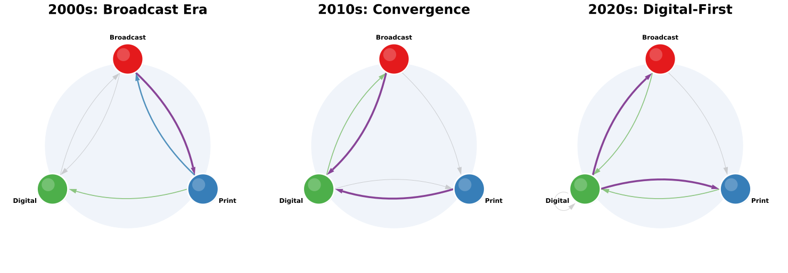
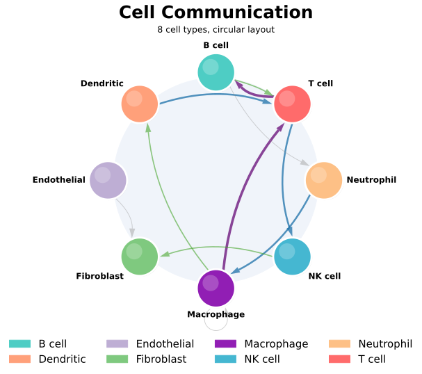
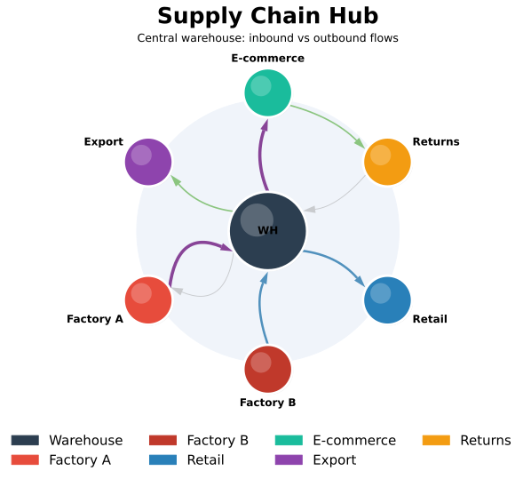
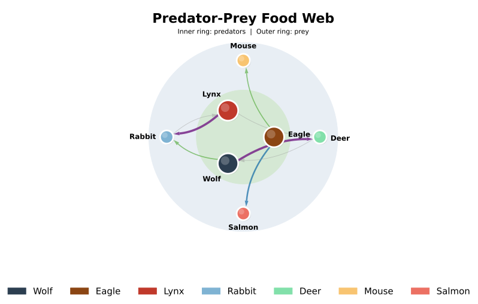
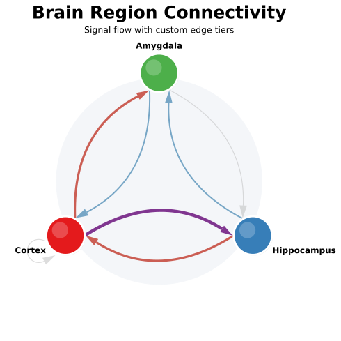
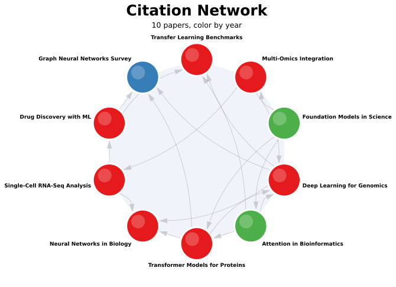
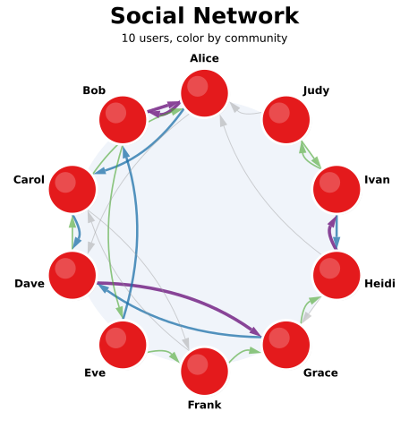

<h1 align="center">netbubbles</h1>

<p align="center">
  <strong>Directed bubble-graph visualisation with curved arrows</strong>
</p>

<p align="center">
  <a href="https://pypi.org/project/netbubbles/"></a>
  <a href="LICENSE"></a>
  
</p>

---

**netbubbles** is a Python library for creating publication-quality bubble-graph visualisations of directed weighted networks. It uses circular nodes with curved arrow edges, supports multiple layout algorithms, and comes with domain-specific presets for biology, bibliometrics, software engineering, and more.

<p align="center">
  
</p>

## Features

- **Multiple layouts** - circular, focus (hub-and-spoke), bilayer (concentric rings), grid, manual
- **Curved arrow edges** with automatic angle spreading and arrowheads
- **Weighted edges** with configurable colour/size tiers
- **Self-loop support** for recursive relationships
- **Domain presets** - LIANA cell-cell communication, citation networks, software dependencies, data pipelines, web graphs, social networks
- **Fully customizable** - colours, fonts, shadows, highlights, background, edge styles
- **Multi-panel figures** - compose multiple graphs in a single figure
- **Legend support** for node colour keys
- **Graph operations** - subgraph extraction, edge filtering, aggregation, node merging
- **Built on matplotlib** - integrates with any matplotlib workflow

## Installation

```bash
pip install netbubbles
```

For preset modules that use pandas:

```bash
pip install netbubbles[presets]
```

## Quick Start

```python
import netbubbles as nb

g = nb.BubbleGraph.from_weighted_edges(
    {("A", "B"): 10, ("B", "C"): 7, ("C", "A"): 5, ("B", "A"): 3},
    colors={"A": "#E41A1C", "B": "#377EB8", "C": "#4DAF4A"},
)

ax = nb.draw(g, title="My Network")
ax.figure.savefig("network.png", dpi=150, bbox_inches="tight")
```

For layouts, presets, customization and graph operations see **[docs/usage.md](docs/usage.md)**.

## Gallery

<table>
  <tr>
    <td align="center"><b>Circular Layout</b></td>
    <td align="center"><b>Focus Layout</b></td>
    <td align="center"><b>Bilayer Layout</b></td>
  </tr>
  <tr>
    <td></td>
    <td></td>
    <td></td>
  </tr>
  <tr>
    <td align="center"><b>Custom Style</b></td>
    <td align="center"><b>Citation Network</b></td>
    <td align="center"><b>Social Network</b></td>
  </tr>
  <tr>
    <td></td>
    <td></td>
    <td></td>
  </tr>
</table>

## Examples

15 runnable scripts covering all layouts and presets - see **[docs/examples.md](docs/examples.md)** for the full list with previews.

```bash
cd examples && python generate_all.py
```

## Citation

If you use **netbubbles** in a publication, please cite it:

**APA:**

> dam2452. (2026). netbubbles: Directed bubble-graph visualisation with curved arrows (Version 0.2.0). https://github.com/dam2452/netbubbles

**BibTeX:**

```bibtex
@software{netbubbles2026,
  title   = {netbubbles: Directed bubble-graph visualisation with curved arrows},
  author  = {dam2452},
  year    = {2026},
  version = {0.2.0},
  url     = {https://github.com/dam2452/netbubbles}
}
```

## Contributing

Contributions are welcome! Here's how you can help:

1. **Bug reports** - Open an issue with a minimal reproducible example
2. **Feature requests** - Open an issue describing the use case
3. **Code contributions** - Fork, create a feature branch, and open a pull request
4. **New presets** - Add a new submodule under `netbubbles/presets/` with a `to_graph()` function and an example

### Development setup

```bash
git clone https://github.com/dam2452/netbubbles.git
cd netbubbles
pip install -e ".[dev]"
pytest tests/
```

## License

This project is licensed under **CC BY-NC-SA 4.0** - [Creative Commons Attribution-NonCommercial-ShareAlike 4.0 International](https://creativecommons.org/licenses/by-nc-sa/4.0/).

- **Use it freely** - for research, education, personal projects
- **Cite the author** - attribution required in publications and derivative works
- **No commercial use** - you may not sell or monetize this software
- **Share changes back** - modifications must be distributed under the same license (pull requests welcome!)

See [LICENSE](LICENSE) for full details.
