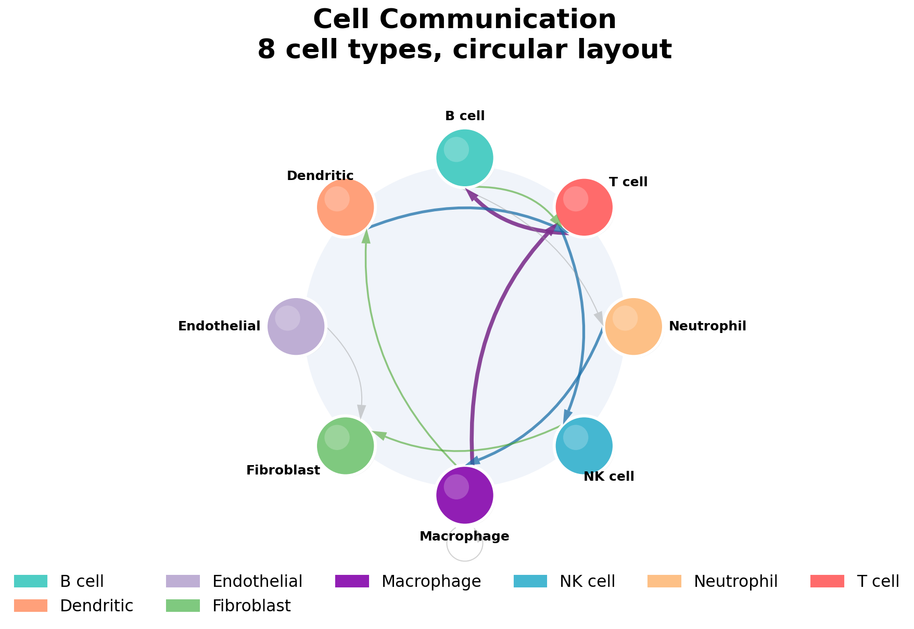
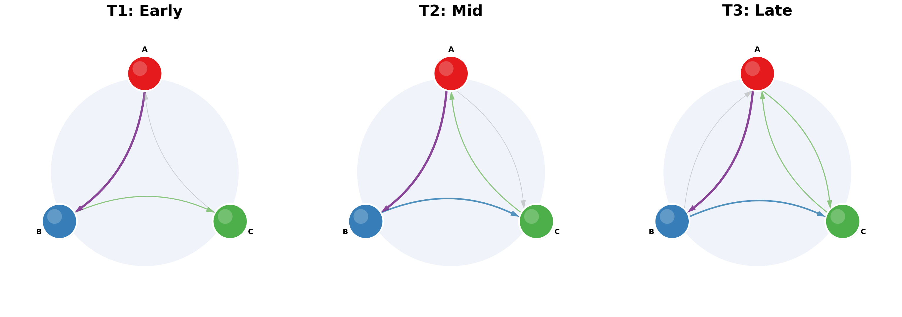
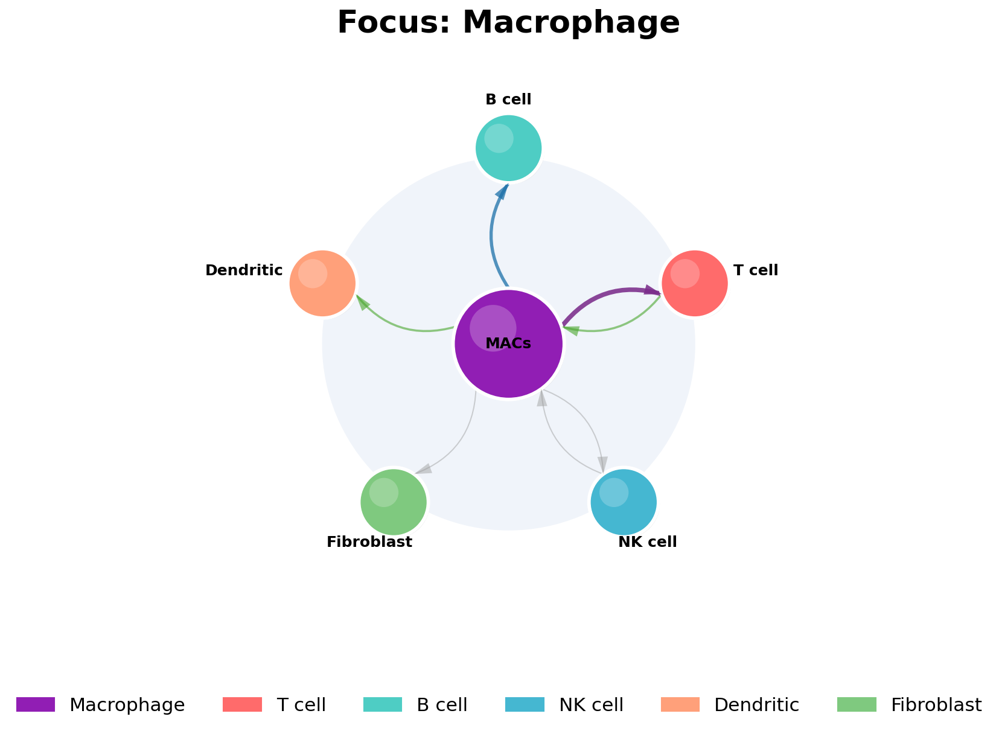
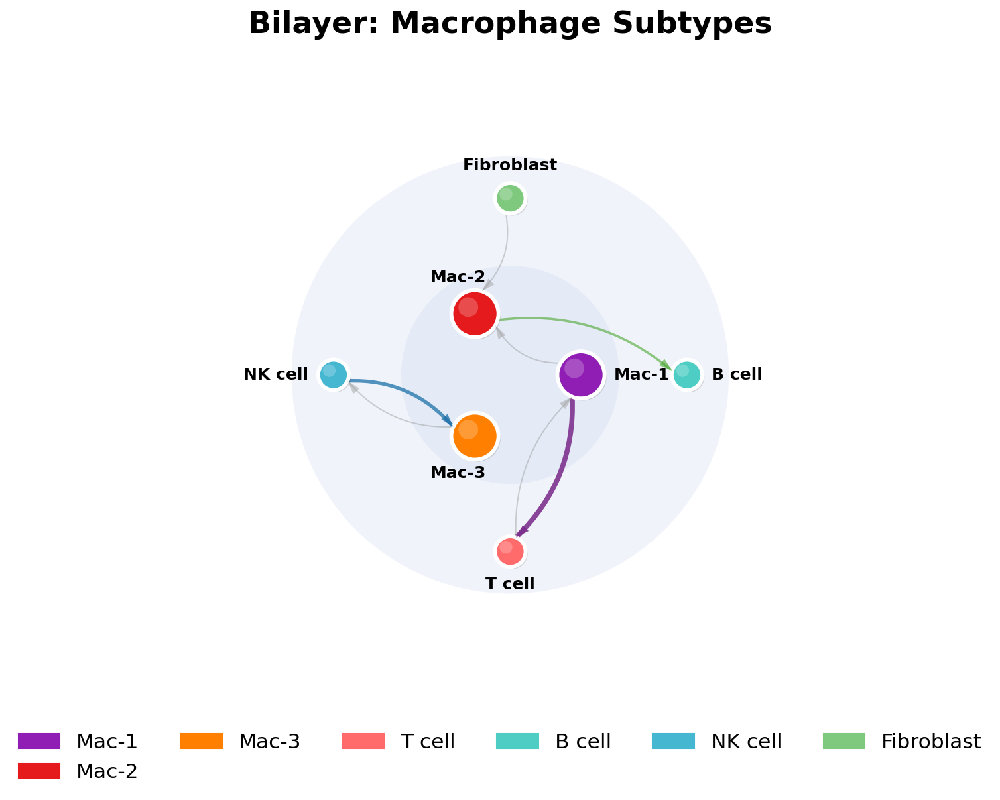
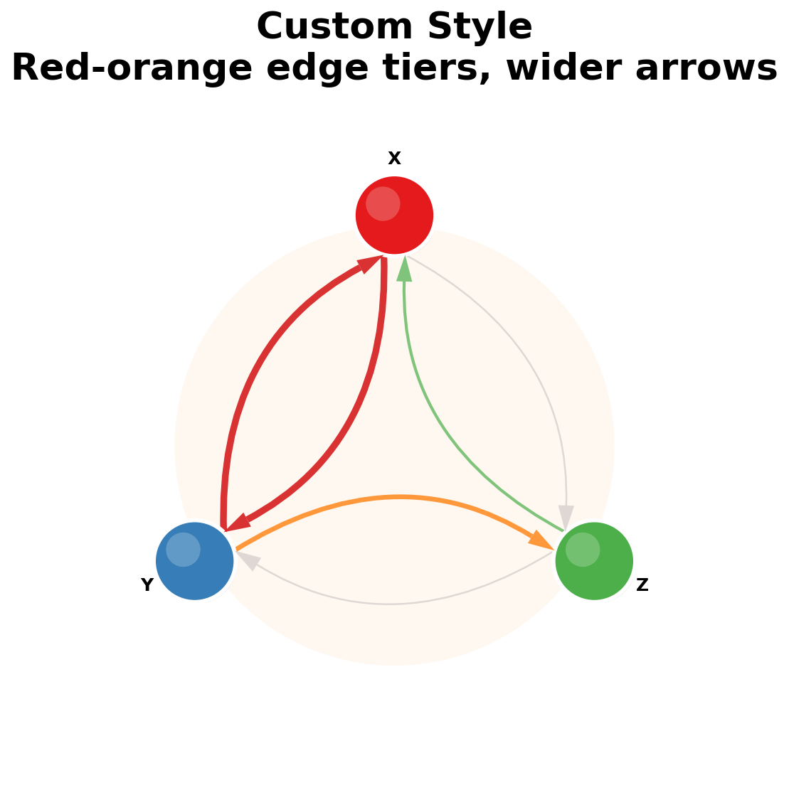

<p align="center">
  <!-- Replace with your logo/banner -->
  
</p>

<h1 align="center">netbubbles</h1>

<p align="center">
  <strong>Directed bubble-graph visualisation with curved arrows</strong>
</p>

<p align="center">
  <a href="https://pypi.org/project/netbubbles/"></a>
  <a href="LICENSE"></a>
  
</p>

---

**netbubbles** is a Python library for creating publication-quality bubble-graph visualisations of directed weighted networks. It uses circular nodes with curved arrow edges, supports multiple layout algorithms, and comes with domain-specific presets for biology, bibliometrics, software engineering, and more.

<!-- Replace with a demo GIF -->


## Features

- **Multiple layouts** — circular, focus (hub-and-spoke), bilayer (concentric rings), grid, manual
- **Curved arrow edges** with automatic angle spreading and arrowheads
- **Weighted edges** with configurable colour/size tiers
- **Self-loop support** for recursive relationships
- **Domain presets** — LIANA cell-cell communication, citation networks, software dependencies, data pipelines, web graphs, social networks
- **Fully customizable** — colours, fonts, shadows, highlights, background, edge styles
- **Multi-panel figures** — compose multiple graphs in a single figure
- **Legend support** for node colour keys
- **Graph operations** — subgraph extraction, edge filtering, aggregation, node merging
- **Built on matplotlib** — integrates with any matplotlib workflow

## Installation

```bash
pip install netbubbles
```

For preset modules that use pandas:

```bash
pip install netbubbles[presets]
```

## Quick Start

```python
import netbubbles as nb

# Build a graph
g = nb.BubbleGraph.from_weighted_edges(
    {("A", "B"): 10, ("B", "C"): 7, ("C", "A"): 5, ("B", "A"): 3},
    colors={"A": "#E41A1C", "B": "#377EB8", "C": "#4DAF4A"},
)

# Draw it
ax = nb.draw(g, title="My Network")
ax.figure.savefig("network.png", dpi=150, bbox_inches="tight")
```

## Gallery

<table>
  <tr>
    <td align="center"><b>Circular Layout</b></td>
    <td align="center"><b>Focus Layout</b></td>
    <td align="center"><b>Bilayer Layout</b></td>
  </tr>
  <tr>
    <td></td>
    <td></td>
    <td></td>
  </tr>
  <tr>
    <td align="center"><b>Custom Style</b></td>
    <td align="center"><b>Citation Network</b></td>
    <td align="center"><b>Social Network</b></td>
  </tr>
  <tr>
    <td></td>
    <td></td>
    <td></td>
  </tr>
</table>

<!-- Add more images or a GIF demo here -->

## Layouts

| Layout | Description | Use case |
|--------|-------------|----------|
| `circular` | Nodes on a circle | General networks, equal importance |
| `focus` | One node centered, rest on a ring | Hub-and-spoke, dominant node |
| `bilayer` | Two concentric rings | Compare inner vs outer groups |
| `grid` | Regular grid | Sequential or matrix layouts |
| `manual` | User-supplied coordinates | Full custom positioning |

```python
from netbubbles import circular, focus, bilayer, grid, manual

pos = circular(node_names, radius=3.0)
pos = focus(node_names, center="Hub")
pos = bilayer(inner_nodes, outer_nodes)
```

## Domain Presets

### LIANA — Cell-Cell Communication

```python
from netbubbles.presets import liana

df = liana.load_results(cache_dir)
g = liana.to_graph(df["timepoint_1"], node_colors=colors)
g_merged = liana.merge_nodes(g, "Mac", "Macrophage")
```

### Citation Networks

```python
from netbubbles.presets import citations

entries = citations.parse_bibtex("references.bib")
g = citations.to_graph(entries, citation_map=cites, mode="paper")
```

### Software Dependencies

```python
from netbubbles.presets import dependencies

deps = dependencies.parse_requirements("requirements.txt")
g = dependencies.to_graph(deps, root="my-app")
```

### Data Pipelines

```python
from netbubbles.presets import pipeline

steps = [
    {"name": "Extract", "type": "extract", "inputs": []},
    {"name": "Transform", "type": "transform", "inputs": ["Extract"]},
    {"name": "Load", "type": "store", "inputs": ["Transform"]},
]
g = pipeline.to_graph(steps)
```

### Web Link Graphs

```python
from netbubbles.presets import webgraph

links = {"home": ["about", "blog"], "blog": ["home", "post-1"]}
g = webgraph.from_links(links, root="home")
```

### Social Networks

```python
from netbubbles.presets import social

edges = [("Alice", "Bob", 12), ("Bob", "Alice", 10), ("Alice", "Carol", 5)]
g = social.from_edge_list(edges)
clusters = social.detect_clusters(g)
g_colored = social.from_edge_list(edges, clusters=clusters)
```

## Customization

### Style

```python
from netbubbles import Style
from netbubbles.style import EdgeTier

my_style = Style(
    node_edgecolor="black",
    node_edgewidth=2.0,
    shadow_offset=0.02,
    background_color="#F5F5F5",
    curve_strength=0.25,
    edge_tiers=[
        EdgeTier("#D62728", 4.5, 0.95),  # strongest edges
        EdgeTier("#FF7F0E", 3.2, 0.80),
        EdgeTier("#2CA02C", 2.0, 0.60),
        EdgeTier("#AAAAAA", 1.2, 0.40),  # weakest edges
    ],
    label_fontsize=14,
    title_fontsize=28,
)

ax = nb.draw(graph, style=my_style, title="Custom Styled")
```

### Graph Operations

```python
# Extract a subgraph
sub = g.subgraph(["A", "B", "C"])

# Filter edges by weight
heavy = g.filter_edges(lambda e: e.weight >= 5)

# Aggregate duplicate edges
agg = g.aggregate_edges()
```

### Legends & Multi-Panel

```python
# Add a colour legend
nb.add_legend(fig, node_names, color_dict)

# Compose multiple panels
fig, axes = plt.subplots(1, 3, figsize=(21, 7))
for ax, data in zip(axes, datasets):
    nb.draw(graph, ax=ax, title=data["label"])
```

## Examples

See the [`examples/`](examples/) directory for complete, runnable scripts:

| # | Example | Description |
|---|---------|-------------|
| 01 | `01_basic_network.py` | Circular network with 8 nodes |
| 02 | `02_focus_layout.py` | Hub-and-spoke focus layout |
| 03 | `03_bilayer_layout.py` | Two concentric rings |
| 04 | `04_weighted_edges.py` | Quick `from_weighted_edges()` constructor |
| 05 | `05_adjacency_matrix.py` | Adjacency matrix constructor |
| 06 | `06_custom_style.py` | Custom edge tiers and colours |
| 07 | `07_liana_preset.py` | LIANA cell-cell communication |
| 08 | `08_subgraph_filter.py` | Subgraph extraction and edge filtering |
| 09 | `09_multipanel.py` | Multi-panel time series |
| 10 | `10_merge_nodes.py` | Node merging |
| 11 | `11_citation_network.py` | Bibliographic citation network |
| 12 | `12_dependencies.py` | Software dependency tree |
| 13 | `13_pipeline.py` | Data pipeline / ETL flow |
| 14 | `14_webgraph.py` | Web page link graph |
| 15 | `15_social_network.py` | Social network with community detection |

Generate all outputs:

```bash
cd examples && python generate_all.py
```

## Citation

If you use **netbubbles** in a publication, please cite it:

**APA:**

> dam2452. (2025). netbubbles: Directed bubble-graph visualisation with curved arrows (Version 0.2.0). https://github.com/dam2452/netbubbles

**BibTeX:**

```bibtex
@software{netbubbles2025,
  title   = {netbubbles: Directed bubble-graph visualisation with curved arrows},
  author  = {dam2452},
  year    = {2025},
  version = {0.2.0},
  url     = {https://github.com/dam2452/netbubbles}
}
```

## Contributing

Contributions are welcome! Here's how you can help:

1. **Bug reports** — Open an issue with a minimal reproducible example
2. **Feature requests** — Open an issue describing the use case
3. **Code contributions** — Fork, create a feature branch, and open a pull request
4. **New presets** — Add a new submodule under `netbubbles/presets/` with a `to_graph()` function and an example

### Development setup

```bash
git clone https://github.com/dam2452/netbubbles.git
cd netbubbles
pip install -e ".[dev]"
pytest tests/
```

## License

This project is licensed under **CC BY-NC-SA 4.0** — [Creative Commons Attribution-NonCommercial-ShareAlike 4.0 International](https://creativecommons.org/licenses/by-nc-sa/4.0/).

- **Use it freely** — for research, education, personal projects
- **Cite the author** — attribution required in publications and derivative works
- **No commercial use** — you may not sell or monetize this software
- **Share changes back** — modifications must be distributed under the same license (pull requests welcome!)

See [LICENSE](LICENSE) for full details.
